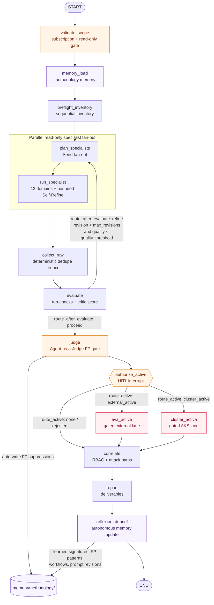
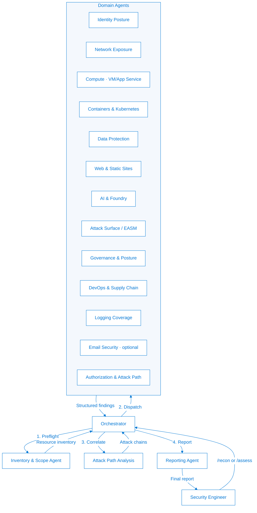

<p align="center">
  
</p>

<p align="center">
  
  
  
  
  
  
  
  
  <a href="https://contoso-state.github.io/red-team-agent-orchestration/"></a>
</p>

<p align="center">
  <b>An agentic red team for Azure cloud security.</b><br>
  A coordinated team of AI agents — each a domain specialist — runs comprehensive,
  <b>read-only</b> penetration testing against your Azure environment, then hands you a
  leadership-ready report, an interactive HTML report, and a slide deck.
</p>

<p align="center">
  <a href="https://contoso-state.github.io/red-team-agent-orchestration/"><b>📖 Documentation</b></a> ·
  <a href="#-quick-start"><b>Quick Start</b></a> ·
  <a href="#-graph-engineering--self-improving-loops"><b>Graph Architecture</b></a> ·
  <a href="#-how-it-works"><b>How It Works</b></a> ·
  <a href="#-scoping-large-subscriptions"><b>Scoping at Scale</b></a> ·
  <a href="#-agent-team"><b>Agent Team</b></a> ·
  <a href="#-session-output"><b>Session Output</b></a> ·
  <a href="#-operating-modes"><b>Operating Modes</b></a> ·
  <a href="#-safety--authorization"><b>Safety</b></a>
</p>

<p align="center">
  <a href="https://raw.githack.com/Contoso-State/red-team-agent-orchestration/main/tools/report/sample/report.sample.html"><b>📊 View the live sample report</b></a>
  &nbsp;·&nbsp;
  <a href="tools/report/sample/report.sample.html"><b>source</b></a>
  <br>
  <sub>A full fictional engagement, rendered by the report generator — interactive attack-path graph, expandable findings, print-to-PDF.</sub>
</p>

---

## ⚠️ AI Disclosure & Disclaimer

**This project uses AI agents (powered by GitHub Copilot / Claude models) to conduct penetration testing and security assessments.** AI models can make errors, generate false positives, miss vulnerabilities, or misinterpret findings. **Use at your own risk and validate all findings independently.** This tool is intended as a **starting point** for security assessments, not a replacement for professional human review. **You assume full responsibility for:**
- Verifying all findings before acting on them
- Independently validating any vulnerability claims
- Assessing the accuracy and completeness of the assessment
- Ensuring all assessments are authorized and compliant with your policies and laws

For production environments, always combine agentic assessments with manual review by experienced security professionals.

**Not affiliated with Microsoft.** This is an independent demonstration project — it is **not** affiliated with, endorsed by, or sponsored by Microsoft. *"Contoso"* is a fictitious company name Microsoft uses throughout its own samples and documentation; it is used here only in that same demonstration spirit. *"Microsoft"* and *"Azure"* are trademarks of Microsoft Corporation.

The team ships as native **GitHub Copilot CLI** primitives, so once this repo is checked out Copilot automatically discovers the Pentest Manager and its specialists. Three cooperating layers make it work:

- **Custom agents** (`.github/agents/*.agent.md`) — the dispatchable team. The user-invocable **Orchestrator** (Pentest Manager) coordinates and hands tasks to fifteen domain sub-agents via Copilot's `agent` (Task) tool. This is the wiring that lets "the agent the user talks to" actually call the specialist agents.
- **Skills** (`.github/skills/azure-redteam-*`) — auto-loaded domain knowledge. Copilot pulls the relevant skill in based on its `description`, giving every agent its methodology and `az` runner without manual wiring.
- **Extension / hooks** (`.github/extensions/redteam-guardrails`) — a `preToolUse` hook that **enforces read-only**, denying any mutating `az`/`azd` command unless `engagement.yaml` explicitly opts into `controlled-validation`.

Start the team with `/agent redteam-orchestrator` (or just ask Copilot to "run an Azure red team assessment").

## 🕸️ Graph engineering & self-improving loops

The primary architecture is the canonical declarative graph in
[`graph/redteam.graph.json`](graph/redteam.graph.json): scope validation and read-only permission
checks run first, prior methodology memory is loaded, specialists fan out in parallel, findings
fan back in through deterministic reducers, the evaluator-optimizer loop reflects only while
bounded by `max_revisions: 2` and `quality_threshold: 0.85`, and the judge/debrief nodes
self-improve `memory/methodology/` for later runs.



One graph has two engines: the dependency-free Node runner (`tools/graph/run-graph.mjs`) for the
four CLI runtimes, and the first-class LangGraph target in
[`integrations/langgraph/`](integrations/langgraph/) for Python deployment. Self-improvement is
auto-applied at runtime with no PR or human gate, but the memory firewall keeps the read-only
guard immutable: it can never modify `guardrails/**`, egress/cluster allowlists, or role
requirements. Full reference: [`doc/graph-engineering.md`](doc/graph-engineering.md).

## 🤖 Agent Team

<p align="center">
  
</p>

| Agent | Domain | Key Focus |
|---|---|---|
| **Orchestrator** | Coordination | Engagement lifecycle, task dispatch, finding aggregation |
| **Inventory & Scope** | Preflight | Resource enumeration, permission validation, scope enforcement |
| **Identity Posture** | Entra ID | MFA gaps, Conditional Access, app registrations, guest users, credential hygiene |
| **Authorization & Attack Path** | RBAC / Privilege | Over-permissioned roles, custom role abuse, managed identity chains, priv esc paths |
| **Network Exposure** | Networking | Public IPs, NSG rules, firewall gaps, VNet peering, DNS exposure, private endpoints |
| **Compute Platform** | Compute (VM / App Service / Functions) | VM disk encryption & patching, public RunCommand exposure, Function Apps, App Service auth / FTP-debug / plaintext-secret hardening |
| **Azure Container & Kubernetes** | AKS / Kubernetes / ACR / Containers | AKS & in-cluster Kubernetes RBAC, Pod Security Admission, workload identity, ACR content-trust & image scanning, Container Apps/Instances — read-only posture **plus an optional, hard-gated lane that scans *inside* running containers** |
| **Data Protection** | Storage / Data / SQL | Storage account exposure, Key Vault policies, SQL & database firewall rules, encryption |
| **Web & Static Sites** | Web edge / delivery | CDN/Front Door, WAF, TLS, Static Web Apps & storage static sites, API Management |
| **AI & Foundry** | AI services | Azure AI Foundry, Azure OpenAI, Cognitive Services, Machine Learning workspace exposure |
| **Attack Surface (EASM)** | External exposure | Outside-in footprint, dangling DNS / subdomain takeover, orphaned IPs, unknown assets |
| **Logging Coverage** | Monitoring | Diagnostic settings, Sentinel connectors, alert rules, Activity Log gaps |
| **Governance & Posture** | Governance / Posture | Azure Policy guardrails & exemptions, Defender for Cloud secure score, management-group hierarchy, resource locks |
| **DevOps & Supply Chain** | CI/CD / Supply chain | Workload identity federation (OIDC), pipeline service principals, ACR admin/tasks, Automation Accounts, Logic Apps |
| **Email Security** *(optional)* | Microsoft 365 | SPF/DKIM/DMARC, Exchange Online Protection, Defender for Office 365, mail-flow rules |
| **External Vulnerability (EVA)** *(gated, active)* | Active external testing | OWASP Top 10 validation of Azure-discovered URLs/IPs + optional offline static analysis — scope-locked, **off by default** |
| **Reporting** | Output | Finding normalization, severity reconciliation, executive + technical reports |

> The **Email Security** agent covers Microsoft 365 / Exchange Online and is dispatched only when M365 is in engagement scope. EntraID, RBAC, and SQL/databases are covered by the Identity, Authorization, and Data agents respectively; AKS / Kubernetes / containers / ACR are covered by the dedicated **Azure Container & Kubernetes** agent (the Compute agent now focuses on VMs, App Service, and Functions).

> **The Azure Container & Kubernetes agent** runs a read-only posture assessment by default. Its **cluster-active lane** — the only path that reaches *inside* a running cluster/container or pulls and scans images — is **off by default** and unlocks only when the engagement `mode` is `cluster-active-testing` with a signed authorization, scope-locked fail-closed to an Azure-derived cluster/registry allowlist by a third cluster guardrail (alongside the read-only and egress guardrails).

> **The External Vulnerability Agent (EVA)** is the only agent that sends real traffic to live endpoints. It is **off by default** and dispatched only when the engagement `mode` is `external-active-testing` with a signed authorization. EVA tests **only** hosts on an Azure-derived allowlist, enforced fail-closed by a second egress guardrail. See [Operating Modes](#-operating-modes) and the [EVA docs](https://contoso-state.github.io/red-team-agent-orchestration/external-vuln).

## 🧭 How It Works

The diagram below is the **conceptual lifecycle** — recon, dispatch, correlate, report. The
**authoritative execution model** is the canonical graph in
[Graph engineering & self-improving loops](#-graph-engineering--self-improving-loops) above: the
same four phases, plus the bounded evaluator-optimizer reflection loop, the Agent-as-a-Judge
false-positive gate, the human-in-the-loop authorization interrupt for gated active lanes, and the
autonomous methodology-memory nodes that let each run learn from the last.



## 🎯 Scoping Large Subscriptions

A single Azure subscription can hold **thousands of resources**, so the team does **not** blindly
assess everything. Instead of enumerating every resource one-by-one (slow, throttled, noisy), it
runs an **aggregation-first, budget-bounded** workflow and lets you steer it.

**It asks what you care about.** During `/setup` (and again in `/recon` once the inventory exists)
the Orchestrator asks **"What is your assessment focus for this subscription?"**:

| Focus | What it targets |
|---|---|
| **Full estate** | Everything (default) |
| **Public / internet exposure** | Public IPs, NSGs, firewalls, Front Door / WAF |
| **Virtual Machines & compute** | VMs, scale sets, AKS, containers, App Service |
| **Data stores** | Storage, Key Vault, SQL, Cosmos DB |
| **Identity & access** | Entra ID, RBAC, managed identities, privilege escalation |
| **AI / Foundry** | Azure OpenAI, Cognitive Services, ML / AI Foundry |
| **Logging & governance** | Monitoring coverage, Policy, Defender posture |
| **DevOps & supply chain** | ACR, OIDC creds, automation, Logic Apps |
| **Specific resource types** | Name them — e.g. *just Virtual Machines*, *just Public IP addresses* |

Your answer fills `scope.domains` and `scope.resource_types` in `engagement.yaml`, which **Azure
Resource Graph applies server-side** — so a "just VMs and public IPs" run never even pulls the other
9,000 resources back. After inventory, `/recon` shows the real composition and lets you narrow
further ("start with the exposed surface?").

**How the run stays bounded** (see [`knowledge/scaling.md`](knowledge/scaling.md)):

- **Census cheap, sample expensive** — Resource Graph filters server-side and returns only vulnerable candidates; per-resource (data-plane) calls are a budgeted fallback, not the default.
- **Aggregate by default** — one misconfiguration across 800 storage accounts is **one finding** with `affected_resources[]`, not 800. Findings carry a `finding_class` + `dedupe_key` so identical issues collapse, even across subscriptions.
- **Budgets, not best-effort** — `scale.*` knobs (`sample_per_type`, `max_resource_calls`, `time_budget_min`, `concurrency`, `prioritize_exposed`) cap the work; `tools/orchestration/estimate-cost.mjs` projects API calls / runtime *before* the run so you can narrow scope first.
- **Durable, resumable orchestration** — work is a task manifest keyed by `(agent, subscription, check, scope)`; an interrupted run resumes (skips `done`, retries `failed`) and a deterministic reduce merges per-task output.
- **Honest coverage** — every task's outcome (`assessed` / `sampled` / `skipped-by-budget` / `failed` / `permission-denied` / `partial`) becomes a coverage cell, so a reader never mistakes *"not assessed"* for *"no findings."*
- **Scripted evaluation, agentic judgment** — the mechanical pass/fail evaluation of deterministic checks runs in a **zero-LLM engine** (`tools/checks/run-checks.mjs`) over a per-domain *predicate bank* (`checks/<domain>/predicates.json` — **99 of 147 checks** mechanized). Agents stay the primary reasoning engine but read a **compact triage summary** instead of raw Azure JSON, so token spend goes to correlation and attack-path judgment, not field comparison. Every report carries a **total token-usage** figure (Appendix D) and respects an optional `scale.token_budget`. See [`knowledge/token-optimization.md`](knowledge/token-optimization.md).

| Concept | Tool |
|---|---|
| Deterministic check engine (zero-LLM predicate eval) | `tools/checks/run-checks.mjs` |
| Token ledger + per-report usage accounting | `tools/tokens/ledger.mjs` |
| Inventory census (paged ARG) | `tools/powershell/Export-Inventory.ps1` |
| Scope brief (operator rollup) | `tools/resource-graph/scope-brief.mjs` |
| Preflight cost / time estimate | `tools/orchestration/estimate-cost.mjs` |
| Durable task manifest (plan / resume / reduce) | `tools/orchestration/manifest.mjs` |
| Coverage matrix (honest gaps) | `tools/orchestration/coverage.mjs` |
| Bounded per-resource fan-out | `tools/powershell/Invoke-BoundedFanout.ps1` |
| Engagement datastore (SQLite cache + history) | `tools/datastore/` |

## 🧩 How the Team Is Packaged (Agents + Skills + Hooks)

The team uses three native Copilot CLI layers that map cleanly onto **who acts**, **what they know**, and **what they're allowed to do**.

### 1. Custom agents — the dispatchable team (`.github/agents/`)

The Orchestrator is the only **user-invocable** agent; the fifteen specialists set
`disable-model-invocation: true` so they run only when the Orchestrator dispatches them through the
`agent` (Task) tool. This is the dispatch wiring that makes "the orchestrator calls the respective
agent" real. The Orchestrator is **dispatch-only** — it has no `execute`/shell capability, so it
never runs `az` itself; it assigns work to the specialist and presents the findings they return.

| Agent file | Display name | Invoked by |
|---|---|---|
| `redteam-orchestrator.agent.md` | Red Team Orchestrator (Pentest Manager) | **User** (`/agent redteam-orchestrator`) |
| `redteam-inventory.agent.md` | Red Team Inventory & Scope | Orchestrator |
| `redteam-identity.agent.md` | Red Team Identity | Orchestrator |
| `redteam-authorization.agent.md` | Red Team Authorization | Orchestrator |
| `redteam-network.agent.md` | Red Team Network | Orchestrator |
| `redteam-compute.agent.md` | Red Team Compute (VM / App Service / Functions) | Orchestrator |
| `redteam-aks-container.agent.md` | Red Team Azure Container & Kubernetes (gated in-cluster lane) | Orchestrator |
| `redteam-data.agent.md` | Red Team Data (incl. SQL/databases) | Orchestrator |
| `redteam-web.agent.md` | Red Team Web & Static Sites | Orchestrator |
| `redteam-ai.agent.md` | Red Team AI & Foundry | Orchestrator |
| `redteam-easm.agent.md` | Red Team Attack Surface (EASM) | Orchestrator |
| `redteam-logging.agent.md` | Red Team Logging | Orchestrator |
| `redteam-governance.agent.md` | Red Team Governance & Posture | Orchestrator |
| `redteam-supplychain.agent.md` | Red Team DevOps & Supply Chain | Orchestrator |
| `redteam-email.agent.md` | Red Team Email Security *(optional, M365)* | Orchestrator |
| `redteam-reporting.agent.md` | Red Team Reporting | Orchestrator |

### 2. Skills — auto-loaded domain knowledge (`.github/skills/`)

Each agent's deep methodology is a Copilot skill, loaded automatically by `description`.

| Skill | When Copilot uses it |
|---|---|
| `azure-redteam-orchestrator` | **Pentest Manager.** "Run a red team assessment", "pentest my Azure environment" |
| `azure-redteam-inventory` | Preflight recon — permission validation + resource enumeration |
| `azure-redteam-identity` | Entra ID / authentication posture |
| `azure-redteam-authorization` | RBAC, privilege escalation, attack-path correlation |
| `azure-redteam-network` | Public exposure, NSGs, segmentation |
| `azure-redteam-compute` | VM, App Service, Function App, serverless compute security |
| `azure-redteam-aks-container` | AKS / Kubernetes RBAC & Pod Security, ACR, Container Apps/Instances + gated in-cluster scanning |
| `azure-redteam-data` | Storage, Key Vault, SQL / database protection |
| `azure-redteam-web` | Web edge/delivery: WAF, TLS, static sites, API Management |
| `azure-redteam-ai` | Azure AI Foundry, OpenAI, Cognitive Services, ML |
| `azure-redteam-easm` | External attack surface, dangling DNS, unknown assets |
| `azure-redteam-logging` | Detection & monitoring coverage |
| `azure-redteam-governance` | Azure Policy, Defender for Cloud posture, MG hierarchy, resource locks |
| `azure-redteam-supplychain` | OIDC/federated credentials, pipeline SPs, ACR, automation, Logic Apps |
| `azure-redteam-email` | M365 email security (SPF/DKIM/DMARC, Defender for Office 365) — optional |
| `azure-redteam-reporting` | Normalize findings, render deliverables |

> The **Identity Posture** agent additionally loads the supporting **`msgraph-sdk`** skill — a Microsoft Graph SDK reference used to enumerate Entra ID configuration (users, app registrations, Conditional Access) read-only via `az rest`/Graph. All other domains map one-to-one to an `azure-redteam-*` skill above.

### 3. Extension / hooks — read-only enforcement (`.github/extensions/redteam-guardrails`)

A session-wide `preToolUse` hook enforces read-only as an **allowlist (deny-by-default)**: only
recognized read/query operations pass; everything else on `az`/`azd` or Azure PowerShell (`*-Az*`)
is treated as a state change and blocked, so unknown or new mutating verbs fail closed. It is
**wrapper-aware** (unwraps `pwsh -Command`, `powershell -EncodedCommand`, `bash -c`, `cmd /c`,
`iex`, `&`, `Start-Process … -ArgumentList`) and **tool-scoped** (only command-execution tools are
inspected — docs that merely mention `az ... delete` are never blocked). `mode:
controlled-validation` doesn't silently allow mutations; it downgrades them to an explicit
human-approval prompt. Decision logic lives in `guardrails-core.mjs` and is unit-tested by
`guardrails-core.test.mjs` (133 assertions). Because the hook is session-wide it covers **every**
agent — and the orchestrator additionally has **no shell access at all** (dispatch-only), so it can
never run `az` itself.

Each skill stays thin and delegates to the detailed methodology in `agents/<name>/system-prompt.md` and the atomic tests in `checks/<domain>/checks.yaml`, keeping a single source of truth. Every domain agent runs **its own read-only `az` CLI assessment** using the per-domain command runner in `tools/az-cli/<domain>.md` (each command keyed to a check ID). The slash commands in `.github/prompts/` (`/setup`, `/recon`, `/assess`, `/attack-paths`, `/report`, `/deck`, and the gated `/external`) are convenient entry points that drive the same team.

## 🧠 Runs on Copilot, Claude, Codex & Cursor

The same team runs on four AI runtimes. One platform-neutral guard core
(`guardrails/guard.mjs`) backs every runtime, so a given command reaches an **identical**
allow / ask / deny decision everywhere — the read-only guarantee never forks per platform.

| Runtime | Reads its team from | Read-only enforced by | Launch |
|---|---|---|---|
| **GitHub Copilot CLI** | `.github/agents`, `.github/skills`, `.github/prompts` | `.github/extensions/redteam-guardrails` | `/agent redteam-orchestrator` |
| **Claude Code** | `.claude/agents`, `.claude/skills`, `.claude/commands` | `.claude/hooks/redteam-guard.mjs` | `/agent redteam-orchestrator` |
| **OpenAI Codex CLI** | `AGENTS.md` + `.agents/skills` | `.codex/hooks/redteam-guard.mjs` + `.codex/config.toml` | ask Codex to *"run an Azure red team assessment"* |
| **Cursor** | `.cursor/rules`, `.cursor/commands` + `.github/skills` | `.cursor/hooks/redteam-guard.mjs` | invoke the rule / command in chat |

The Copilot definitions under `.github/` are canonical; the per-platform files are produced by
an **anti-drift generator** so the runtimes can never silently diverge:

```bash
node tools/agents/build-agent-defs.mjs          # regenerate every runtime
node tools/agents/build-agent-defs.mjs --check  # CI: fail if any runtime is stale
```

The generator also surfaces the canonical **graph-orchestration standard** — derived directly
from [`graph/redteam.graph.json`](graph/redteam.graph.json) — into each runtime, so every platform
plans and runs engagements as the *same* self-improving graph (executed by the dependency-free
`tools/graph/run-graph.mjs`, or the LangGraph target for Python deployments).

> **Codex first-run trust:** Codex requires you to trust the project hook before it runs —
> start Codex in the repo and run **`/hooks`** once to trust
> `.codex/hooks/redteam-guard.mjs`. Full per-runtime setup is in the
> [AI Model Runtimes](https://contoso-state.github.io/red-team-agent-orchestration/runtimes)
> guide.

## 🚀 Quick Start

> **First time?** See [Prerequisites](#-prerequisites) (Azure CLI + `resource-graph`
> extension, Node.js ≥ 22.5, `az login`). Then verify your machine is ready:
>
> ```bash
> node tools/preflight/check-environment.mjs
> ```
>
> It confirms Node, the Azure CLI, your sign-in, and the `resource-graph` extension,
> and tells you exactly how to fix anything missing — all read-only.

### 1. Define engagement scope

Run the guided setup — it lists the subscriptions you can access, asks which **single** subscription to assess, asks
**what your assessment focus is** (the whole estate, or a slice like *Virtual Machines*, *Public IP
addresses*, *Data stores*, *Identity*…), and writes `engagement.yaml` for you:

```text
/setup
```

> Single-subscription contract: one engagement run targets exactly one subscription. To assess additional subscriptions, run `/setup` again and create a separate run.

Prefer to do it by hand? Copy the template instead:

```bash
cp engagement.example.yaml engagement.yaml
# Edit engagement.yaml with target subscription, tenant, and permissions
```

### 2. Start the Pentest Manager

```text
/agent redteam-orchestrator
```

This launches the Orchestrator (Pentest Manager), which dispatches the domain sub-agents for you. The slash commands below are shortcuts that drive the same team.

### 3. Run reconnaissance

```text
/recon
```

The orchestrator will:
- Open a fresh per-run session folder `engagements/<session>/` (where `<session>` = `<engagement-id>-<timestamp>`) that holds **all** output for this run and is gitignored
- Validate your Azure permissions (preflight)
- Enumerate all in-scope resources (Resource Graph filters by your assessment focus server-side)
- Build a resource inventory + **scope brief** (counts, rollups, internet-facing surface)
- **Refine the focus against what's actually there** — e.g. "I found 1,200 storage accounts and 18 public IPs; want to start with the exposed surface?"
- Identify which domain agents to dispatch

### 4. Run full assessment

```text
/assess
```

Dispatches all domain agents against the inventory. Each agent produces structured findings in `engagements/<session>/findings/raw/`.

### 5. Analyze attack paths

```text
/attack-paths
```

Correlates findings across domains to identify multi-step compromise chains.

### 6. Generate report

```text
/report
```

Normalizes findings, deduplicates, reconciles severity, and generates the
executive summary, technical report, normalized `findings.json`, and an
**interactive HTML report** (`report.html`) in `engagements/<session>/reports/`.
The HTML report is a self-contained, offline, **print-first consulting
deliverable** — cover page, table of contents, executive summary, attack paths,
findings, prioritized recommendations, an asset/scope inventory, a
**consolidated pan/zoom attack graph**, and method appendices. Attack-path
nodes are clickable, findings expand in place, and it exports to PDF cleanly. It
is rendered straight from `findings.json` by `tools/report/generate-report.mjs`
(see [`tools/report/README.md`](tools/report/README.md)). A fictional rendered
example lives at **[`tools/report/sample/report.sample.html`](tools/report/sample/report.sample.html)**
([**view it live**](https://raw.githack.com/Contoso-State/red-team-agent-orchestration/main/tools/report/sample/report.sample.html)) —
open it in a browser to explore the interactive deliverable.

### 7. Build the presentation deck

```text
/deck
```

Renders `engagements/<session>/reports/assessment-deck.md` — a PowerPoint-convertible slide deck. Convert it to
`.pptx` with Marp (`npx @marp-team/marp-cli engagements/<session>/reports/assessment-deck.md -o assessment-deck.pptx`)
or Pandoc (`pandoc engagements/<session>/reports/assessment-deck.md -o assessment-deck.pptx --slide-level=2`).
`/report` also emits this deck automatically.

## 📂 Session Output

Every assessment **run** writes **all** of its output into a single, self-contained folder named for
the engagement and the moment it ran — nothing is scattered across the repo root:

```
engagements/
└── <session>/                        # <engagement-id>-<YYYY-MM-DD-HHMMSS>
    ├── engagement.yaml               # scope snapshot used by this run
    ├── engagement.db                 # SQLite datastore — cache + canonical store (gitignored)
    ├── inventory/                    # resources.jsonl, subscriptions.json, coverage-limitations.json
    ├── findings/                     # raw/<agent>.jsonl + normalized/findings.json
    ├── evidence/                     # raw + sanitized artifacts
    └── reports/                      # executive-summary, technical-report, report.html, assessment-deck, findings.json, delta.json
```

A sibling `engagements/_history/<engagement.id>.db` accumulates every run so the report can show what
changed (new / persisting / resolved / regressed). Both the per-session `engagement.db` and the history
DB let agents query cached configuration instead of re-hitting Azure — see
[`knowledge/datastore.md`](knowledge/datastore.md).

- **Timestamped, never overwritten** — `<session>` = `<engagement.id>` + a UTC `YYYY-MM-DD-HHMMSS`
  stamp (e.g. `example-2026-q2-2026-06-15-141200`), so re-running produces a new folder and keeps a
  clean, auditable history of every assessment.
- **Fully gitignored** — the entire `engagements/` tree is ignored (only `README.md` + `.gitkeep` are
  tracked) because session output contains sensitive target data. Never commit a session folder.
- **Opened automatically** — the Orchestrator (and `/recon`) creates the folder at the start of a run
  and tells every dispatched agent the exact path to write under. With the PowerShell helpers, set
  `$env:REDTEAM_SESSION` or pass `-SessionPath ./engagements/<session>`.

See [`engagements/README.md`](engagements/README.md) for the full layout reference.

## 🗄️ Engagement Datastore

Each run is backed by a **dependency-free SQLite datastore** (`engagement.db`) that acts as both the
**cache** and the **canonical store** for the assessment — so the team stops re-querying Azure for the
same data on every step. It is built on Node's built-in `node:sqlite` (no npm install).

- **Query, don't re-crawl** — inventory, per-resource configuration facts, and the resource graph are
  ingested once; domain agents read them back as a **read-through cache** (with a freshness TTL) instead
  of issuing another `az`/ARG call. Cache hit → no Azure call; miss/stale → targeted query, then ingest.
- **One place to join** — findings, resources, identity edges, and coverage live together, so
  attack-path reasoning is a SQL join rather than N files merged in a prompt.
- **Cross-run lifecycle** — a sibling `engagements/_history/<engagement.id>.db` folds in every run and
  classifies findings as **new / persisting / resolved / regressed**, emitting a `reports/delta.json`
  the executive summary leads with.
- **Single writer, safe by default** — `ingest.mjs` is the only writer (agents read freely); the read
  API is read-only-guarded; **every `*.db` is gitignored** and `resource_facts` stores **config only,
  never secrets**.

| Tool | Role |
|---|---|
| `tools/datastore/ingest.mjs` | files → DB (the single writer; dedupes findings, unions `affected_resources[]`) |
| `tools/datastore/query.mjs` | read-only cache API (`resources` / `facts` / `fresh` / `neighbors` / `next-tasks` / `stats`) |
| `tools/datastore/export.mjs` | DB → canonical `findings.json` / `coverage.json` / inventory |
| `tools/datastore/promote.mjs` | fold a run into history + emit the `new/persisting/resolved/regressed` delta |

Full reference: [`knowledge/datastore.md`](knowledge/datastore.md).

## 🎚️ Operating Modes

| Mode | Description | Risk Level |
|---|---|---|
| `read-only-assessment` | Enumerate and analyze configurations only | 🟢 Safe |
| `attack-path-analysis` | Read-only + build attack path graphs | 🟡 Low |
| `controlled-validation` | Read-only + state-changing actions require explicit human approval (the guardrail prompts, never auto-allows) | 🟠 Medium |
| `external-active-testing` | Unlocks the gated **External Vulnerability Agent (EVA)** for active OWASP Top 10 testing of Azure-discovered URLs/IPs — scope-locked to an Azure-derived allowlist, requires a signed authorization, **off by default** | 🔴 High |
| `cluster-active-testing` | Unlocks the gated cluster-active lane of the **Azure Container & Kubernetes** agent — `kubectl exec`/`debug`, in-cluster benchmarks (kube-bench/kubesec), and image CVE scans (trivy/grype) against an Azure-derived cluster/registry allowlist, requires a signed authorization, **off by default** | 🔴 High |

Mode is set in `engagement.yaml` and enforced by the `redteam-guardrails` hook across all agents.
`external-active-testing` additionally arms a second, independent fail-closed **egress** guardrail so
EVA can never reach a host that isn't on the Azure-derived target allowlist; `cluster-active-testing`
arms a third, independent fail-closed **cluster** guardrail so no in-cluster/image command can touch a
cluster or registry that isn't on the Azure-derived allowlist. Both lanes are off by default and never
mutate workloads. Run EVA with `/external`.
See the [EVA documentation](https://contoso-state.github.io/red-team-agent-orchestration/external-vuln) for the full safety model.

## 🗂️ Repository Structure

```
├── engagement.example.yaml      # Engagement scope template
├── .github/
│   ├── agents/                  # Custom agents — dispatchable team (redteam-orchestrator + 15 specialists + gated EVA)
│   ├── skills/                  # Copilot skills — auto-loaded domain knowledge (azure-redteam-*)
│   ├── extensions/              # Hooks — redteam-guardrails enforces read-only (preToolUse deny) + EVA egress lock
│   └── prompts/                 # Slash commands: /setup /recon /assess /attack-paths /report /deck /external (gated)
├── graph/                       # Canonical declarative engagement graph (redteam.graph.json) — the single source of truth for orchestration
├── agents/                      # Agent system prompts and methodology (skills delegate here)
│   ├── orchestrator/            # Team lead — coordinates the engagement
│   ├── inventory-scope/         # Preflight — enumeration and permission checks
│   ├── identity-posture/        # Entra ID and authentication security
│   ├── authorization-attack-path/ # RBAC analysis and privilege escalation
│   ├── network-exposure/        # Network security and public exposure
│   ├── compute-platform/        # VM, App Service, Function App, serverless security
│   ├── aks-container/           # AKS / Kubernetes / ACR / containers + gated in-cluster active lane
│   ├── data-protection/         # Storage, SQL/databases, Key Vault, encryption
│   ├── web-exposure/            # Web edge: WAF, TLS, static sites, API Management
│   ├── ai-foundry/              # Azure AI Foundry, OpenAI, Cognitive Services, ML
│   ├── attack-surface/          # External attack surface (EASM), dangling DNS
│   ├── email-security/          # M365 email security (optional)
│   ├── logging-coverage/        # Monitoring, Sentinel, diagnostic settings
│   ├── governance-posture/      # Azure Policy, Defender posture, MG hierarchy, resource locks
│   ├── devops-supplychain/      # OIDC/federated creds, pipeline SPs, ACR, automation, Logic Apps
│   ├── external-vuln/           # External Vulnerability Agent (EVA) — gated active OWASP testing
│   └── reporting/               # Finding normalization and report generation
├── checks/                      # Atomic security checks per domain
├── playbooks/                   # Multi-step assessment methodologies
├── schemas/                    # JSON schemas — findings, attack paths, checks, engagement, task, coverage, graph
├── controls/                    # CIS Azure, MITRE ATT&CK, NIST CSF 2.0, Defender mappings
├── knowledge/                   # Azure attack matrix, Entra/K8s/container/OAuth-SAML-JWT/CSPM methodology, scaling, datastore
├── tools/                       # az CLI runners (per domain), KQL, Resource Graph, PowerShell, HTML report generator
│   ├── preflight/              # Environment doctor — verifies az, sign-in, resource-graph ext, Node
│   ├── orchestration/          # Scale: task manifest, coverage matrix, preflight cost estimate
│   ├── graph/                 # Graph engine (dependency-free): validate-graph, run-graph runner, self-improve loops
│   ├── datastore/              # SQLite engagement datastore: ingest / query / export / promote
│   ├── resource-graph/         # ARG queries + scope-brief generator
│   ├── powershell/             # Inventory export + bounded per-resource fan-out
│   ├── cluster/                # Gated cluster-active lane: allowlist builder, safe kube audit, scoped scanner
│   └── report/                 # Findings-driven HTML report generator + sample
├── integrations/
│   └── langgraph/               # First-class LangGraph target — compiles the same graph.json into a Python StateGraph (same guard, isolated deps)
├── memory/                      # Self-improvement store — methodology memory (FP suppressions, workflows, prompt revisions); runtime logs gitignored
├── reports/templates/           # Report templates (tracked)
└── engagements/                 # Per-session output — one folder per run (gitignored)
    ├── _history/                # Cross-run lifecycle DBs (<engagement.id>.db, gitignored)
    └── <session>/               # <engagement-id>-<YYYY-MM-DD-HHMMSS>
        ├── engagement.db        # SQLite cache + canonical store (gitignored)
        ├── inventory/           # Resource inventory + coverage limitations
        ├── findings/            # raw/<agent>.jsonl + normalized findings
        ├── evidence/            # raw + sanitized evidence artifacts
        └── reports/             # executive-summary, technical-report, report.html, deck, findings.json
```

## 🧾 Findings Model

All findings are structured JSON — reports are rendered from them, never hand-written.

```json
{
  "id": "AZ-STOR-001",
  "title": "Storage account permits public blob access",
  "severity": "High",
  "confidence": "High",
  "agent": "data-protection",
  "resource_id": "/subscriptions/.../storageAccounts/example",
  "category": "Storage",
  "attack_vector": "Public exposure → unauthenticated data access",
  "evidence": [],
  "recommendation": "Disable public blob access at the storage account level",
  "controls": { "cis_azure": ["3.7"], "mitre": ["T1530"] }
}
```

## ⚖️ Severity Model

Severity is determined by five factors — agents propose, the reporting agent normalizes:

| Factor | Weight | Description |
|---|---|---|
| Exploitability | High | How easy is this to exploit? |
| Exposure | High | Is the resource internet-facing? |
| Blast Radius | Medium | What's the scope of impact? |
| Data Sensitivity | Medium | Does this affect sensitive data? |
| Compensating Controls | Low | Are there mitigations in place? |

## 🛡️ Safety & Authorization

- **Scope enforcement**: Every agent validates target resources against `engagement.yaml`
- **Preflight checks**: Permissions validated before any assessment begins
- **Read-only default**: The default mode only reads configurations — no mutations
- **Per-session isolation**: Every run writes all output to its own gitignored `engagements/<session>/` folder, so sensitive target data is never committed and runs never overwrite each other
- **Hook-enforced guardrail**: The `redteam-guardrails` extension applies a session-wide `preToolUse` deny that allows **only** recognized read/query Azure commands (allowlist / deny-by-default), across both `az`/`azd` and Azure PowerShell — so read-only is enforced even if an agent is misprompted, not just requested
- **Dispatch-only orchestrator**: The Pentest Manager has no shell access; it assigns work to specialists and presents their findings, so it can never run `az` directly
- **Evidence redaction**: Secrets are never stored; PII redaction is configurable
- **Audit trail**: All agent actions and findings are logged with timestamps

## ✅ Prerequisites

Install these once before your first run (the [environment doctor](#-quick-start) checks them all for you):

| Requirement | Why | Install / verify |
|---|---|---|
| **GitHub Copilot CLI** | Hosts the agents, skills, and guardrail | [Copilot CLI install guide](https://docs.github.com/copilot/github-copilot-in-the-cli) |
| **Azure CLI** (`az`) | Every domain agent runs read-only `az` queries | [Install Azure CLI](https://learn.microsoft.com/cli/azure/install-azure-cli) |
| **`resource-graph` extension** | Inventory + scope brief run `az graph query` | `az extension add --name resource-graph` |
| **Node.js ≥ 22.5** | Engagement datastore + report generator use the built-in `node:sqlite` (no `npm install`) | [nodejs.org](https://nodejs.org/) · `node --version` |
| **Azure sign-in** | Assessments run as your identity | `az login` |

**Minimum Azure RBAC on the target scope:** `Reader` + `Security Reader`.
**Recommended (improves coverage):** `Log Analytics Reader`, `Directory Reader`, `Key Vault Reader`.

> The assessment is **read-only** — assign your identity only read roles. The guardrail
> blocks state-changing `az`/`azd` commands regardless, but Reader-only RBAC is the real
> protection (defense in depth).

## 📄 License

Released under the [MIT License](LICENSE). This is a template — fork it, scope it to your
own tenant, and run it against environments you are **authorized** to assess.

## 🙏 Attribution

Portions of the detection methodology and attack-technique knowledge were harvested and
adapted from the Apache-2.0 project [`mukul975/Anthropic-Cybersecurity-Skills`](https://github.com/mukul975/Anthropic-Cybersecurity-Skills).
See [`THIRD_PARTY_NOTICES.md`](THIRD_PARTY_NOTICES.md) for the full license text and
[`knowledge/ATTRIBUTION.md`](knowledge/ATTRIBUTION.md) for the per-skill → artifact map.
All adapted material is read-only methodology — no active/offensive commands were added to
any command runner.
