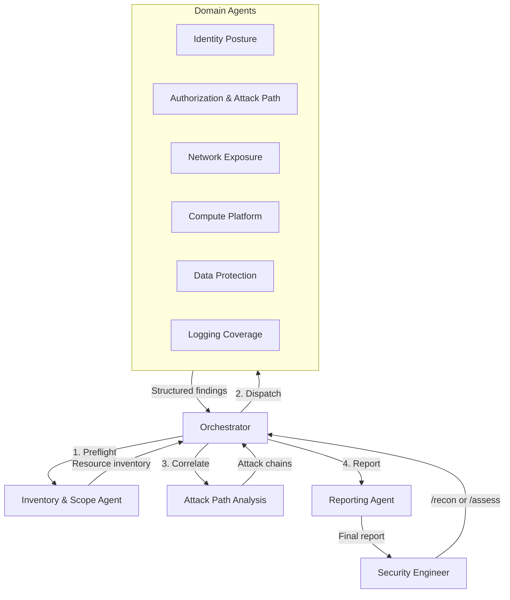

# Azure Red Team Agent Orchestration

Agentic red team platform for identifying security vulnerabilities in Azure cloud infrastructure. A coordinated team of AI agents — each specialized in a security domain — performs comprehensive penetration testing against Azure environments.

The team ships as **GitHub Copilot skills** (`.github/skills/azure-redteam-*`), so once this repo is checked out, Copilot automatically discovers the Pentest Manager and its specialists. Just ask Copilot to "run an Azure red team assessment" and the `azure-redteam-orchestrator` skill takes over.

## How It Works



## Agent Team

| Agent | Domain | Key Focus |
|---|---|---|
| **Orchestrator** | Coordination | Engagement lifecycle, task dispatch, finding aggregation |
| **Inventory & Scope** | Preflight | Resource enumeration, permission validation, scope enforcement |
| **Identity Posture** | Entra ID | MFA gaps, Conditional Access, app registrations, guest users, credential hygiene |
| **Authorization & Attack Path** | RBAC / Privilege | Over-permissioned roles, custom role abuse, managed identity chains, priv esc paths |
| **Network Exposure** | Networking | Public IPs, NSG rules, firewall gaps, VNet peering, DNS exposure, private endpoints |
| **Compute Platform** | Compute | VM patching, AKS security, Container Apps, Function Apps, App Service hardening |
| **Data Protection** | Storage / Data | Storage account exposure, Key Vault policies, database firewall rules, encryption |
| **Logging Coverage** | Monitoring | Diagnostic settings, Sentinel connectors, alert rules, Activity Log gaps |
| **Reporting** | Output | Finding normalization, severity reconciliation, executive + technical reports |

## How the Team Is Packaged (Copilot Skills)

Each agent is a Copilot skill under `.github/skills/`. Copilot loads them automatically based on each skill's `description`, so you invoke the team in plain language — no manual wiring.

| Skill | When Copilot uses it |
|---|---|
| `azure-redteam-orchestrator` | **Pentest Manager.** "Run a red team assessment", "pentest my Azure environment" |
| `azure-redteam-inventory` | Preflight recon — permission validation + resource enumeration |
| `azure-redteam-identity` | Entra ID / authentication posture |
| `azure-redteam-authorization` | RBAC, privilege escalation, attack-path correlation |
| `azure-redteam-network` | Public exposure, NSGs, segmentation |
| `azure-redteam-compute` | VM, AKS, container, serverless security |
| `azure-redteam-data` | Storage, Key Vault, database protection |
| `azure-redteam-logging` | Detection & monitoring coverage |
| `azure-redteam-reporting` | Normalize findings, render deliverables |

Each skill stays thin and delegates to the detailed methodology in `agents/<name>/system-prompt.md` and the atomic tests in `checks/<domain>/checks.yaml`, keeping a single source of truth. Every domain agent runs **its own read-only `az` CLI assessment** using the per-domain command runner in `tools/az-cli/<domain>.md` (each command keyed to a check ID). The slash commands in `.github/prompts/` (`/recon`, `/assess`, `/attack-paths`, `/report`) are convenient entry points that drive the same skills.

## Quick Start

### 1. Define engagement scope

```bash
cp engagement.example.yaml engagement.yaml
# Edit engagement.yaml with target subscription, tenant, and permissions
```

### 2. Run reconnaissance

```text
/recon
```

The orchestrator will:
- Validate your Azure permissions (preflight)
- Enumerate all resources in scope
- Build a resource inventory
- Identify which domain agents to dispatch

### 3. Run full assessment

```text
/assess
```

Dispatches all domain agents against the inventory. Each agent produces structured findings in `findings/raw/`.

### 4. Analyze attack paths

```text
/attack-paths
```

Correlates findings across domains to identify multi-step compromise chains.

### 5. Generate report

```text
/report
```

Normalizes findings, deduplicates, reconciles severity, and generates executive + technical reports in `reports/generated/`.

## Operating Modes

| Mode | Description | Risk Level |
|---|---|---|
| `read-only-assessment` | Enumerate and analyze configurations only | 🟢 Safe |
| `attack-path-analysis` | Read-only + build attack path graphs | 🟡 Low |
| `controlled-validation` | Limited safe validation of specific findings | 🟠 Medium |

Mode is set in `engagement.yaml` and enforced by all agents.

## Repository Structure

```
├── engagement.example.yaml      # Engagement scope template
├── .github/
│   ├── skills/                  # Copilot skills — the red team (azure-redteam-*)
│   └── prompts/                 # Slash commands: /recon /assess /attack-paths /report
├── agents/                      # Agent system prompts and methodology (skills delegate here)
│   ├── orchestrator/            # Team lead — coordinates the engagement
│   ├── inventory-scope/         # Preflight — enumeration and permission checks
│   ├── identity-posture/        # Entra ID and authentication security
│   ├── authorization-attack-path/ # RBAC analysis and privilege escalation
│   ├── network-exposure/        # Network security and public exposure
│   ├── compute-platform/        # VM, AKS, containers, serverless security
│   ├── data-protection/         # Storage, databases, Key Vault, encryption
│   ├── logging-coverage/        # Monitoring, Sentinel, diagnostic settings
│   └── reporting/               # Finding normalization and report generation
├── checks/                      # Atomic security checks per domain
├── playbooks/                   # Multi-step assessment methodologies
├── schemas/                     # JSON schemas for findings, checks, engagement
├── controls/                    # CIS, MITRE ATT&CK, Defender mappings
├── knowledge/                   # Azure attack matrix, common misconfigs
├── tools/                       # az CLI runners (per domain), KQL, Resource Graph, PowerShell
├── reports/templates/           # Report templates
├── findings/                    # Assessment output (gitignored: raw/)
├── evidence/                    # Evidence artifacts (gitignored: raw/)
└── inventory/                   # Resource inventory cache (gitignored)
```

## Findings Model

All findings are structured JSON — reports are rendered from them, never hand-written.

```json
{
  "id": "AZ-STOR-001",
  "title": "Storage account permits public blob access",
  "severity": "High",
  "confidence": "High",
  "agent": "data-protection",
  "resource_id": "/subscriptions/.../storageAccounts/example",
  "category": "Storage",
  "attack_vector": "Public exposure → unauthenticated data access",
  "evidence": [],
  "recommendation": "Disable public blob access at the storage account level",
  "controls": { "cis_azure": ["3.7"], "mitre": ["T1530"] }
}
```

## Severity Model

Severity is determined by five factors — agents propose, the reporting agent normalizes:

| Factor | Weight | Description |
|---|---|---|
| Exploitability | High | How easy is this to exploit? |
| Exposure | High | Is the resource internet-facing? |
| Blast Radius | Medium | What's the scope of impact? |
| Data Sensitivity | Medium | Does this affect sensitive data? |
| Compensating Controls | Low | Are there mitigations in place? |

## Safety & Authorization

- **Scope enforcement**: Every agent validates target resources against `engagement.yaml`
- **Preflight checks**: Permissions validated before any assessment begins
- **Read-only default**: The default mode only reads configurations — no mutations
- **Evidence redaction**: Secrets are never stored; PII redaction is configurable
- **Audit trail**: All agent actions and findings are logged with timestamps

## Requirements

- GitHub Copilot with Azure MCP tools enabled
- Azure CLI authenticated (`az login`)
- Minimum Azure RBAC: `Reader` + `Security Reader` on target scope
- Recommended: `Log Analytics Reader`, `Directory Reader`, `Key Vault Reader`
