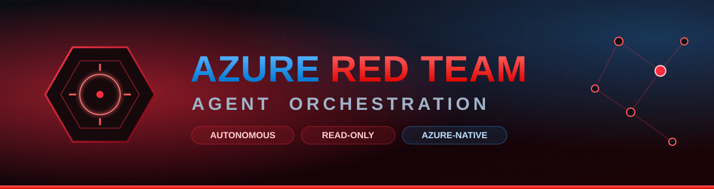
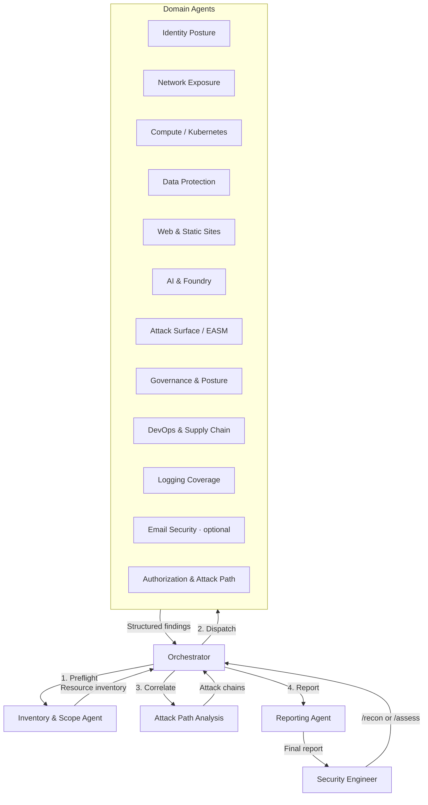
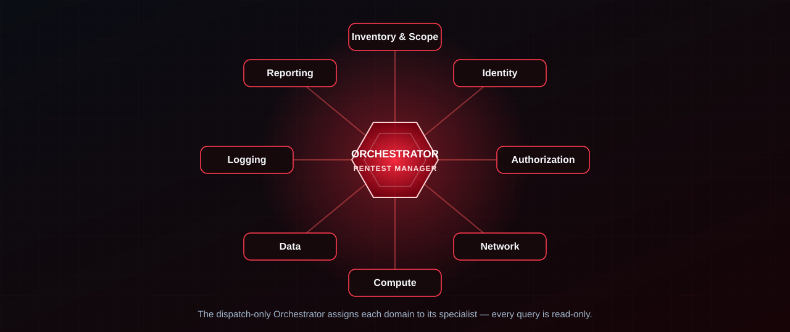

<p align="center">
  
</p>

<p align="center">
  
  
  
  
  
  
</p>

<p align="center">
  <b>An agentic red team for Azure cloud security.</b><br>
  A coordinated team of AI agents — each a domain specialist — runs comprehensive,
  <b>read-only</b> penetration testing against your Azure environment, then hands you a
  leadership-ready report and slide deck.
</p>

<p align="center">
  <a href="#-quick-start"><b>Quick Start</b></a> ·
  <a href="#-how-it-works"><b>How It Works</b></a> ·
  <a href="#-agent-team"><b>Agent Team</b></a> ·
  <a href="#-session-output"><b>Session Output</b></a> ·
  <a href="#-operating-modes"><b>Operating Modes</b></a> ·
  <a href="#-safety--authorization"><b>Safety</b></a>
</p>

---

The team ships as native **GitHub Copilot CLI** primitives, so once this repo is checked out Copilot automatically discovers the Pentest Manager and its specialists. Three cooperating layers make it work:

- **Custom agents** (`.github/agents/*.agent.md`) — the dispatchable team. The user-invocable **Orchestrator** (Pentest Manager) coordinates and hands tasks to fourteen domain sub-agents via Copilot's `agent` (Task) tool. This is the wiring that lets "the agent the user talks to" actually call the specialist agents.
- **Skills** (`.github/skills/azure-redteam-*`) — auto-loaded domain knowledge. Copilot pulls the relevant skill in based on its `description`, giving every agent its methodology and `az` runner without manual wiring.
- **Extension / hooks** (`.github/extensions/redteam-guardrails`) — a `preToolUse` hook that **enforces read-only**, denying any mutating `az`/`azd` command unless `engagement.yaml` explicitly opts into `controlled-validation`.

Start the team with `/agent redteam-orchestrator` (or just ask Copilot to "run an Azure red team assessment").

## 🧭 How It Works



## 🤖 Agent Team

<p align="center">
  
</p>

| Agent | Domain | Key Focus |
|---|---|---|
| **Orchestrator** | Coordination | Engagement lifecycle, task dispatch, finding aggregation |
| **Inventory & Scope** | Preflight | Resource enumeration, permission validation, scope enforcement |
| **Identity Posture** | Entra ID | MFA gaps, Conditional Access, app registrations, guest users, credential hygiene |
| **Authorization & Attack Path** | RBAC / Privilege | Over-permissioned roles, custom role abuse, managed identity chains, priv esc paths |
| **Network Exposure** | Networking | Public IPs, NSG rules, firewall gaps, VNet peering, DNS exposure, private endpoints |
| **Compute Platform** | Compute / Kubernetes / Containers | VM patching, AKS & Kubernetes RBAC, Container Apps/Instances, ACR, Function Apps, App Service hardening |
| **Data Protection** | Storage / Data / SQL | Storage account exposure, Key Vault policies, SQL & database firewall rules, encryption |
| **Web & Static Sites** | Web edge / delivery | CDN/Front Door, WAF, TLS, Static Web Apps & storage static sites, API Management |
| **AI & Foundry** | AI services | Azure AI Foundry, Azure OpenAI, Cognitive Services, Machine Learning workspace exposure |
| **Attack Surface (EASM)** | External exposure | Outside-in footprint, dangling DNS / subdomain takeover, orphaned IPs, unknown assets |
| **Logging Coverage** | Monitoring | Diagnostic settings, Sentinel connectors, alert rules, Activity Log gaps |
| **Governance & Posture** | Governance / Posture | Azure Policy guardrails & exemptions, Defender for Cloud secure score, management-group hierarchy, resource locks |
| **DevOps & Supply Chain** | CI/CD / Supply chain | Workload identity federation (OIDC), pipeline service principals, ACR admin/tasks, Automation Accounts, Logic Apps |
| **Email Security** *(optional)* | Microsoft 365 | SPF/DKIM/DMARC, Exchange Online Protection, Defender for Office 365, mail-flow rules |
| **Reporting** | Output | Finding normalization, severity reconciliation, executive + technical reports |

> The **Email Security** agent covers Microsoft 365 / Exchange Online and is dispatched only when M365 is in engagement scope. EntraID, RBAC, SQL/databases, and Kubernetes/containers are covered by the Identity, Authorization, Data, and Compute agents respectively.

## 🧩 How the Team Is Packaged (Agents + Skills + Hooks)

The team uses three native Copilot CLI layers that map cleanly onto **who acts**, **what they know**, and **what they're allowed to do**.

### 1. Custom agents — the dispatchable team (`.github/agents/`)

The Orchestrator is the only **user-invocable** agent; the fourteen specialists set
`disable-model-invocation: true` so they run only when the Orchestrator dispatches them through the
`agent` (Task) tool. This is the dispatch wiring that makes "the orchestrator calls the respective
agent" real. The Orchestrator is **dispatch-only** — it has no `execute`/shell capability, so it
never runs `az` itself; it assigns work to the specialist and presents the findings they return.

| Agent file | Display name | Invoked by |
|---|---|---|
| `redteam-orchestrator.agent.md` | Red Team Orchestrator (Pentest Manager) | **User** (`/agent redteam-orchestrator`) |
| `redteam-inventory.agent.md` | Red Team Inventory & Scope | Orchestrator |
| `redteam-identity.agent.md` | Red Team Identity | Orchestrator |
| `redteam-authorization.agent.md` | Red Team Authorization | Orchestrator |
| `redteam-network.agent.md` | Red Team Network | Orchestrator |
| `redteam-compute.agent.md` | Red Team Compute (incl. Kubernetes & containers) | Orchestrator |
| `redteam-data.agent.md` | Red Team Data (incl. SQL/databases) | Orchestrator |
| `redteam-web.agent.md` | Red Team Web & Static Sites | Orchestrator |
| `redteam-ai.agent.md` | Red Team AI & Foundry | Orchestrator |
| `redteam-easm.agent.md` | Red Team Attack Surface (EASM) | Orchestrator |
| `redteam-logging.agent.md` | Red Team Logging | Orchestrator |
| `redteam-governance.agent.md` | Red Team Governance & Posture | Orchestrator |
| `redteam-supplychain.agent.md` | Red Team DevOps & Supply Chain | Orchestrator |
| `redteam-email.agent.md` | Red Team Email Security *(optional, M365)* | Orchestrator |
| `redteam-reporting.agent.md` | Red Team Reporting | Orchestrator |

### 2. Skills — auto-loaded domain knowledge (`.github/skills/`)

Each agent's deep methodology is a Copilot skill, loaded automatically by `description`.

| Skill | When Copilot uses it |
|---|---|
| `azure-redteam-orchestrator` | **Pentest Manager.** "Run a red team assessment", "pentest my Azure environment" |
| `azure-redteam-inventory` | Preflight recon — permission validation + resource enumeration |
| `azure-redteam-identity` | Entra ID / authentication posture |
| `azure-redteam-authorization` | RBAC, privilege escalation, attack-path correlation |
| `azure-redteam-network` | Public exposure, NSGs, segmentation |
| `azure-redteam-compute` | VM, AKS / Kubernetes, container, serverless security |
| `azure-redteam-data` | Storage, Key Vault, SQL / database protection |
| `azure-redteam-web` | Web edge/delivery: WAF, TLS, static sites, API Management |
| `azure-redteam-ai` | Azure AI Foundry, OpenAI, Cognitive Services, ML |
| `azure-redteam-easm` | External attack surface, dangling DNS, unknown assets |
| `azure-redteam-logging` | Detection & monitoring coverage |
| `azure-redteam-governance` | Azure Policy, Defender for Cloud posture, MG hierarchy, resource locks |
| `azure-redteam-supplychain` | OIDC/federated credentials, pipeline SPs, ACR, automation, Logic Apps |
| `azure-redteam-email` | M365 email security (SPF/DKIM/DMARC, Defender for Office 365) — optional |
| `azure-redteam-reporting` | Normalize findings, render deliverables |

### 3. Extension / hooks — read-only enforcement (`.github/extensions/redteam-guardrails`)

A session-wide `preToolUse` hook enforces read-only as an **allowlist (deny-by-default)**: only
recognized read/query operations pass; everything else on `az`/`azd` or Azure PowerShell (`*-Az*`)
is treated as a state change and blocked, so unknown or new mutating verbs fail closed. It is
**wrapper-aware** (unwraps `pwsh -Command`, `powershell -EncodedCommand`, `bash -c`, `cmd /c`,
`iex`, `&`, `Start-Process … -ArgumentList`) and **tool-scoped** (only command-execution tools are
inspected — docs that merely mention `az ... delete` are never blocked). `mode:
controlled-validation` doesn't silently allow mutations; it downgrades them to an explicit
human-approval prompt. Decision logic lives in `guardrails-core.mjs` and is unit-tested by
`guardrails-core.test.mjs` (68 assertions). Because the hook is session-wide it covers **every**
agent — and the orchestrator additionally has **no shell access at all** (dispatch-only), so it can
never run `az` itself.

Each skill stays thin and delegates to the detailed methodology in `agents/<name>/system-prompt.md` and the atomic tests in `checks/<domain>/checks.yaml`, keeping a single source of truth. Every domain agent runs **its own read-only `az` CLI assessment** using the per-domain command runner in `tools/az-cli/<domain>.md` (each command keyed to a check ID). The slash commands in `.github/prompts/` (`/setup`, `/recon`, `/assess`, `/attack-paths`, `/report`, `/deck`) are convenient entry points that drive the same team.

## 🚀 Quick Start

### 1. Define engagement scope

Run the guided setup — it lists the subscriptions you can access, asks which one to assess, and
writes `engagement.yaml` for you:

```text
/setup
```

Prefer to do it by hand? Copy the template instead:

```bash
cp engagement.example.yaml engagement.yaml
# Edit engagement.yaml with target subscription, tenant, and permissions
```

### 2. Start the Pentest Manager

```text
/agent redteam-orchestrator
```

This launches the Orchestrator (Pentest Manager), which dispatches the domain sub-agents for you. The slash commands below are shortcuts that drive the same team.

### 3. Run reconnaissance

```text
/recon
```

The orchestrator will:
- Open a fresh per-run session folder `engagements/<session>/` (where `<session>` = `<engagement-id>-<timestamp>`) that holds **all** output for this run and is gitignored
- Validate your Azure permissions (preflight)
- Enumerate all resources in scope
- Build a resource inventory
- Identify which domain agents to dispatch

### 4. Run full assessment

```text
/assess
```

Dispatches all domain agents against the inventory. Each agent produces structured findings in `engagements/<session>/findings/raw/`.

### 5. Analyze attack paths

```text
/attack-paths
```

Correlates findings across domains to identify multi-step compromise chains.

### 6. Generate report

```text
/report
```

Normalizes findings, deduplicates, reconciles severity, and generates executive + technical reports in `engagements/<session>/reports/`.

### 7. Build the presentation deck

```text
/deck
```

Renders `engagements/<session>/reports/assessment-deck.md` — a PowerPoint-convertible slide deck. Convert it to
`.pptx` with Marp (`npx @marp-team/marp-cli engagements/<session>/reports/assessment-deck.md -o assessment-deck.pptx`)
or Pandoc (`pandoc engagements/<session>/reports/assessment-deck.md -o assessment-deck.pptx --slide-level=2`).
`/report` also emits this deck automatically.

## 📂 Session Output

Every assessment **run** writes **all** of its output into a single, self-contained folder named for
the engagement and the moment it ran — nothing is scattered across the repo root:

```
engagements/
└── <session>/                        # <engagement-id>-<YYYY-MM-DD-HHMMSS>
    ├── engagement.yaml               # scope snapshot used by this run
    ├── inventory/                    # resources.jsonl, subscriptions.json, coverage-limitations.json
    ├── findings/                     # raw/<agent>.jsonl + normalized/findings.json
    ├── evidence/                     # raw + sanitized artifacts
    └── reports/                      # executive-summary, technical-report, assessment-deck, findings.json
```

- **Timestamped, never overwritten** — `<session>` = `<engagement.id>` + a UTC `YYYY-MM-DD-HHMMSS`
  stamp (e.g. `example-2026-q2-2026-06-15-141200`), so re-running produces a new folder and keeps a
  clean, auditable history of every assessment.
- **Fully gitignored** — the entire `engagements/` tree is ignored (only `README.md` + `.gitkeep` are
  tracked) because session output contains sensitive target data. Never commit a session folder.
- **Opened automatically** — the Orchestrator (and `/recon`) creates the folder at the start of a run
  and tells every dispatched agent the exact path to write under. With the PowerShell helpers, set
  `$env:REDTEAM_SESSION` or pass `-SessionPath ./engagements/<session>`.

See [`engagements/README.md`](engagements/README.md) for the full layout reference.

## 🎚️ Operating Modes

| Mode | Description | Risk Level |
|---|---|---|
| `read-only-assessment` | Enumerate and analyze configurations only | 🟢 Safe |
| `attack-path-analysis` | Read-only + build attack path graphs | 🟡 Low |
| `controlled-validation` | Read-only + state-changing actions require explicit human approval (the guardrail prompts, never auto-allows) | 🟠 Medium |

Mode is set in `engagement.yaml` and enforced by the `redteam-guardrails` hook across all agents.

## 🗂️ Repository Structure

```
├── engagement.example.yaml      # Engagement scope template
├── .github/
│   ├── agents/                  # Custom agents — dispatchable team (redteam-orchestrator + 14 specialists)
│   ├── skills/                  # Copilot skills — auto-loaded domain knowledge (azure-redteam-*)
│   ├── extensions/              # Hooks — redteam-guardrails enforces read-only (preToolUse deny)
│   └── prompts/                 # Slash commands: /setup /recon /assess /attack-paths /report /deck
├── agents/                      # Agent system prompts and methodology (skills delegate here)
│   ├── orchestrator/            # Team lead — coordinates the engagement
│   ├── inventory-scope/         # Preflight — enumeration and permission checks
│   ├── identity-posture/        # Entra ID and authentication security
│   ├── authorization-attack-path/ # RBAC analysis and privilege escalation
│   ├── network-exposure/        # Network security and public exposure
│   ├── compute-platform/        # VM, AKS / Kubernetes, containers, serverless security
│   ├── data-protection/         # Storage, SQL/databases, Key Vault, encryption
│   ├── web-exposure/            # Web edge: WAF, TLS, static sites, API Management
│   ├── ai-foundry/              # Azure AI Foundry, OpenAI, Cognitive Services, ML
│   ├── attack-surface/          # External attack surface (EASM), dangling DNS
│   ├── email-security/          # M365 email security (optional)
│   ├── logging-coverage/        # Monitoring, Sentinel, diagnostic settings
│   ├── governance-posture/      # Azure Policy, Defender posture, MG hierarchy, resource locks
│   ├── devops-supplychain/      # OIDC/federated creds, pipeline SPs, ACR, automation, Logic Apps
│   └── reporting/               # Finding normalization and report generation
├── checks/                      # Atomic security checks per domain
├── playbooks/                   # Multi-step assessment methodologies
├── schemas/                     # JSON schemas for findings, checks, engagement
├── controls/                    # CIS, MITRE ATT&CK, Defender mappings
├── knowledge/                   # Azure attack matrix, common misconfigs
├── tools/                       # az CLI runners (per domain), KQL, Resource Graph, PowerShell
├── reports/templates/           # Report templates (tracked)
└── engagements/                 # Per-session output — one folder per run (gitignored)
    └── <session>/               # <engagement-id>-<YYYY-MM-DD-HHMMSS>
        ├── inventory/           # Resource inventory + coverage limitations
        ├── findings/            # raw/<agent>.jsonl + normalized findings
        ├── evidence/            # raw + sanitized evidence artifacts
        └── reports/             # executive-summary, technical-report, deck, findings.json
```

## 🧾 Findings Model

All findings are structured JSON — reports are rendered from them, never hand-written.

```json
{
  "id": "AZ-STOR-001",
  "title": "Storage account permits public blob access",
  "severity": "High",
  "confidence": "High",
  "agent": "data-protection",
  "resource_id": "/subscriptions/.../storageAccounts/example",
  "category": "Storage",
  "attack_vector": "Public exposure → unauthenticated data access",
  "evidence": [],
  "recommendation": "Disable public blob access at the storage account level",
  "controls": { "cis_azure": ["3.7"], "mitre": ["T1530"] }
}
```

## ⚖️ Severity Model

Severity is determined by five factors — agents propose, the reporting agent normalizes:

| Factor | Weight | Description |
|---|---|---|
| Exploitability | High | How easy is this to exploit? |
| Exposure | High | Is the resource internet-facing? |
| Blast Radius | Medium | What's the scope of impact? |
| Data Sensitivity | Medium | Does this affect sensitive data? |
| Compensating Controls | Low | Are there mitigations in place? |

## 🛡️ Safety & Authorization

- **Scope enforcement**: Every agent validates target resources against `engagement.yaml`
- **Preflight checks**: Permissions validated before any assessment begins
- **Read-only default**: The default mode only reads configurations — no mutations
- **Per-session isolation**: Every run writes all output to its own gitignored `engagements/<session>/` folder, so sensitive target data is never committed and runs never overwrite each other
- **Hook-enforced guardrail**: The `redteam-guardrails` extension applies a session-wide `preToolUse` deny that allows **only** recognized read/query Azure commands (allowlist / deny-by-default), across both `az`/`azd` and Azure PowerShell — so read-only is enforced even if an agent is misprompted, not just requested
- **Dispatch-only orchestrator**: The Pentest Manager has no shell access; it assigns work to specialists and presents their findings, so it can never run `az` directly
- **Evidence redaction**: Secrets are never stored; PII redaction is configurable
- **Audit trail**: All agent actions and findings are logged with timestamps

## ✅ Requirements

- GitHub Copilot with Azure MCP tools enabled
- Azure CLI authenticated (`az login`)
- Minimum Azure RBAC: `Reader` + `Security Reader` on target scope
- Recommended: `Log Analytics Reader`, `Directory Reader`, `Key Vault Reader`
