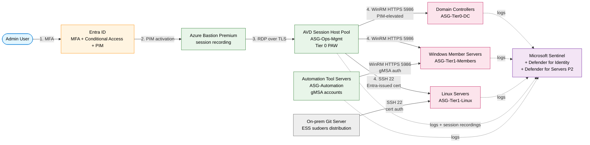
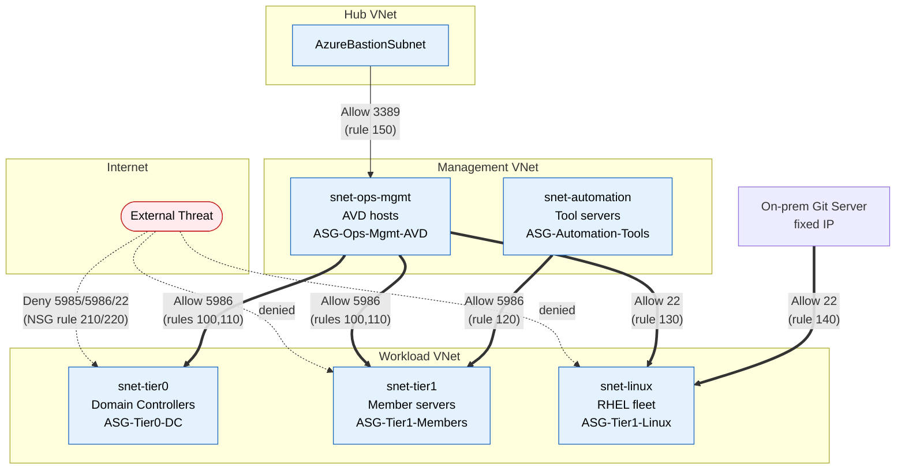
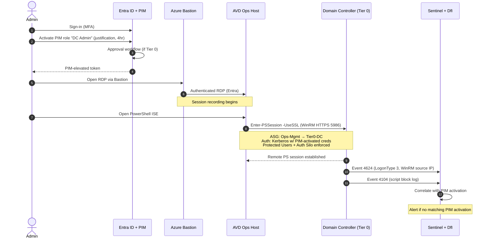
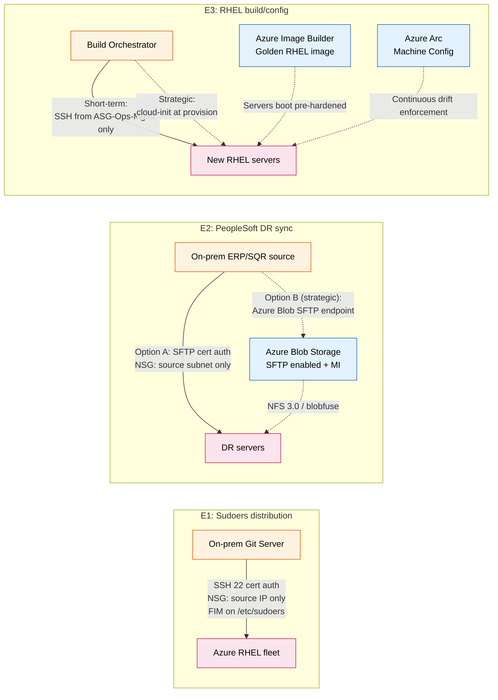
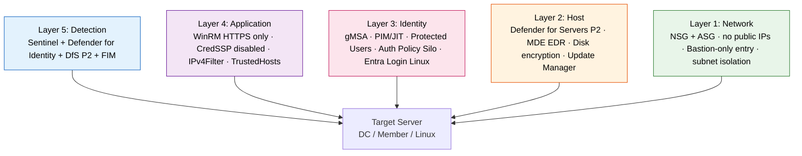

# NYS ITS — Solution Design: WinRM/SSH Lockdown via Network + Identity Segmentation

**Date:** 2026-05-28
**Status:** Working design — Microsoft draft for ITS + ISO discussion
**Related:** [2026-05-28-winrm-ssh-management-scenarios.md](2026-05-28-winrm-ssh-management-scenarios.md)

## Premise

ITS pragmatic position is correct: don't remove WinRM/SSH (would break operational tooling and is high-risk). Instead, **collapse the network attack surface to a single hardened path** while keeping the protocols and tooling intact. This is Microsoft's standard Tier 0 management-plane segmentation guidance.

**Conceptual model:**
```
Admin → Entra ID (MFA + PIM) → Bastion → AVD Session Host (Ops Mgmt Server)
                                              ↓
                                              ↓ WinRM/HTTPS (5986) — ASG-restricted
                                              ↓ SSH (22) — ASG-restricted, Entra cert auth
                                              ↓
                                          Target servers (DCs, members, Linux)
```

---

## 0. Architecture Sketch

### 0.1 End-to-end management flow



### 0.2 Network segmentation — ASG/NSG view



### 0.3 Identity & credential flow



### 0.4 ESS Linux scenarios — applied design



### 0.5 Defense-in-depth layers (what protects what)



**Reading the layers:** any single layer can fail without compromising the system. The original ITS proposal stops at Layer 1; the full design covers Layers 1–5.

---

## 1. Network Layer — NSG + ASG Design

### 1.1 Use Application Security Groups, not IPs

IP-based rules drift and are error-prone. ASGs survive VM scaling and IP reassignment.

**Proposed ASGs:**
| ASG | Purpose |
|-----|---------|
| `ASG-Ops-Mgmt-AVD` | AVD session host pool (human admin workstation + jump path) |
| `ASG-Automation-Tools` | Existing automation/management servers (the tooling from W1) |
| `ASG-Tier0-DC` | Domain controllers (Azure + Arc-managed on-prem) |
| `ASG-Tier1-Members` | Member servers, app servers |
| `ASG-Tier1-Linux` | Linux fleet (RHEL, etc.) |

### 1.2 NSG rule set (applied to target server subnets)

```
Priority  Action  Proto  Port  Source                  Destination          Notes
100       Allow   TCP    5986  ASG-Ops-Mgmt-AVD        ASG-Tier0-DC         Human admin WinRM/HTTPS to DCs
110       Allow   TCP    5986  ASG-Ops-Mgmt-AVD        ASG-Tier1-Members    Human admin WinRM/HTTPS to members
120       Allow   TCP    5986  ASG-Automation-Tools    ASG-Tier1-Members    Automation WinRM/HTTPS
130       Allow   TCP    22    ASG-Ops-Mgmt-AVD        ASG-Tier1-Linux      Human admin SSH
140       Allow   TCP    22    <on-prem-git-server-IP> ASG-Tier1-Linux      ESS sudoers SCP (E1)
150       Allow   TCP    3389  AzureBastionSubnet      ASG-Ops-Mgmt-AVD     Bastion → AVD entry only
200       Deny    TCP    5985  *                       *                    Kill WinRM HTTP everywhere
210       Deny    TCP    5986  Internet                *                    Deny WinRM from Internet
220       Deny    TCP    22    Internet                *                    Deny SSH from Internet
4096      Deny    *      *     *                       *                    Default deny inbound
```

### 1.3 Subnet topology
- Dedicated `snet-ops-mgmt` for AVD hosts
- Dedicated `snet-automation` for existing tooling servers
- Target servers in workload subnets, NSG-protected
- `AzureBastionSubnet` per VNet (or hub VNet with peering)
- All target VMs: **no public IPs**, period.

---

## 2. Host Layer — WinRM Hardening

NSG is L4; not sufficient alone. Defense in depth at the host:

| Setting | Value | Rationale |
|---------|-------|-----------|
| Listener | HTTPS (5986) only | TLS in transit; cert validation prevents spoofing |
| Certificate | Internal PKI-issued | No self-signed; revokable; CA-trusted |
| `IPv4Filter` | Comma-separated allowlist of `ASG-Ops-Mgmt-AVD` subnet | Host-level second layer below NSG |
| `TrustedHosts` (on client) | AVD hosts only | Prevents AVD from accepting WinRM from unexpected sources |
| `AllowUnencrypted` | False | Reject plaintext |
| Authentication | Kerberos preferred; CredSSP **disabled** | CredSSP delegates creds — credential theft risk |
| `winrm/config/service/auth Basic` | False | No basic auth |

PowerShell to apply:
```powershell
Set-Item WSMan:\localhost\Service\AllowUnencrypted -Value $false
Set-Item WSMan:\localhost\Service\Auth\Basic -Value $false
Set-Item WSMan:\localhost\Service\Auth\CredSSP -Value $false
Set-Item WSMan:\localhost\Client\TrustedHosts -Value "avd-ops-*.its.ny.gov"
New-Item -Path WSMan:\localhost\Listener -Transport HTTPS `
    -Address * -CertificateThumbprint <internal-PKI-cert>
# IPv4Filter
Set-Item WSMan:\localhost\Service\IPv4Filter -Value "10.x.y.0/24"
# Remove HTTP listener
Get-ChildItem WSMan:\localhost\Listener | Where-Object Keys -Like "*HTTP" |
    Remove-Item
```

---

## 3. The Operations Management Server is Tier 0

**Critical insight:** the moment WinRM funnels through a single ops server, that server holds the keys to the kingdom. It must be hardened as a Privileged Access Workstation (PAW).

### 3.1 AVD as the Ops Mgmt Server (recommended over standalone VM)
**Why AVD over a standalone VM:**
- Persistent FSLogix profile for admin tooling (RSAT, Az PowerShell, MMC consoles, scripts)
- Image-based — golden master enforced, no drift
- Intune-managed — AppLocker, BitLocker, Defender baseline
- Scales with admin headcount
- Native Entra ID join + Conditional Access

**Why not Bastion alone:** Bastion is stateless transit. Admin tools need to live somewhere persistent — that's AVD.

### 3.2 Bastion as the entry path to AVD
- Bastion **Premium** SKU for session recording + native client (allows file transfer, multi-monitor)
- No direct RDP to AVD from Internet — Bastion only
- MFA enforced via Conditional Access on the Bastion login

### 3.3 AVD/Ops Mgmt Server hardening checklist
- [ ] Intune-managed, Entra ID joined
- [ ] AppLocker policy (allowlist of admin binaries only)
- [ ] No Office, no browser to general internet (admin URLs only)
- [ ] No email client
- [ ] Defender for Servers P2 + MDE EDR enabled
- [ ] JIT VM Access (host pool powered off until needed — or always-on with PIM-gated access)
- [ ] Disk encryption (Azure Disk Encryption / host encryption)
- [ ] Session recording enabled (Bastion Premium or AVD-native)
- [ ] All admin actions logged to Sentinel
- [ ] No saved credentials in Windows Credential Manager
- [ ] LAPS for local admin password if any

---

## 4. Identity & Credential Model

Network controls don't prevent credential theft on the ops server. Identity is the second-half of the design.

### 4.1 For automation tools (replacing service account passwords)
**Use Group Managed Service Accounts (gMSAs):**
- Auto-rotated passwords (every 30 days by default)
- No plaintext password to leak
- Tied to specific computer accounts (the automation servers)
- Works with WinRM PowerShell Remoting

### 4.2 For interactive admin (humans on AVD)
- **PIM-eligible Entra groups** synced to AD groups → mapped to local Administrators on target servers via GPO
- Time-bound activation (e.g., 4 hours max)
- MFA required at PIM activation
- Approval workflow for Tier 0 (DC admin) activations
- All activations logged to Sentinel via Entra audit logs

### 4.3 Authentication Silos (Tier 0 protection)
- Create AD Authentication Policy Silo containing Tier 0 admin accounts + DCs + ops server
- Prevents Tier 0 creds from being used to log on to Tier 1/2 servers (kills lateral movement via cred reuse)
- Use **Protected Users** group for Tier 0 admins (disables NTLM, Kerberos delegation, etc.)

### 4.4 For Linux (ESS scenarios)
- **Microsoft Entra login for Linux VMs** — Entra-issued SSH certificates, no static keys
- PIM-eligible for SSH access just like Windows
- For automation (sudoers SCP from on-prem git): use a dedicated **gMSA-equivalent** (service account with SSH cert, automated rotation via Key Vault)

---

## 5. Monitoring & Detection (non-negotiable for Tier 0)

### 5.1 Logging to enable on all targets
| Log Source | What we get |
|------------|-------------|
| Event 4624/4625 | Logon success/fail (filter LogonType 10 = remote interactive, 3 = network for WinRM) |
| Event 4688 + cmdline | Process creation with full command line |
| PowerShell Event 4103 | Module logging |
| PowerShell Event 4104 | Script block logging (captures encoded/obfuscated PS) |
| Event 4672 | Special privileges assigned to logon |
| Event 4634/4647 | Logoff |
| WinRM operational log | Connection source IP, principal |
| NSG Flow Logs | Network-layer attempted connections |

### 5.2 Sentinel detections to deploy
- WinRM connection from outside `ASG-Ops-Mgmt-AVD`
- WinRM auth failures > N in 5 min (brute force / spray)
- Tier 0 admin session outside business hours
- Process creation with suspicious cmdline (mimikatz, psexec, etc.) on any server reached via WinRM
- PIM activation followed by unusual access patterns
- New local administrator added on a Tier 0 server

### 5.3 Defender for Identity (on DCs)
- Pass-the-hash, pass-the-ticket detection
- DCSync attempts
- Golden ticket detection
- Kerberoasting
- Reconnaissance (SAMR, LDAP enum)

### 5.4 Defender for Servers P2
- MDE EDR on all targets
- Vulnerability management (Qualys/MDVM)
- JIT VM access
- Adaptive application controls
- File integrity monitoring (sudoers file is a perfect FIM target — alerts on unauthorized edits)

### 5.5 NSG Flow Logs → Traffic Analytics
- Visual proof the design holds: only `ASG-Ops-Mgmt-AVD` and `ASG-Automation-Tools` actually talking to target 5986/22
- Detect rule misconfigs (rule allows more than intended)

---

## 6. SSH/Linux Scenario Coverage (ESS Team)

Same pattern, Linux flavor:

### 6.1 E1 — Sudoers SCP from on-prem git server
- NSG: allow 22 from on-prem git server IP only → `ASG-Tier1-Linux`
- Migrate the `unixagent` SSH account to **certificate-based auth** with cert rotated via Key Vault (no static keys)
- Enable **File Integrity Monitoring** on `/etc/sudoers` and `/etc/sudoers.d/` — alerts if anything else modifies it
- **Parallel track:** evaluate Arc Machine Configuration for declarative sudoers policy (longer-term replacement)

### 6.2 E2 — PeopleSoft SFTP DR sync
- NSG: allow 22 from on-prem ERP source subnet only → DR servers
- Same cert-based auth + Key Vault rotation
- **Parallel evaluation:** **Azure Blob Storage with SFTP endpoint** — moves the SFTP endpoint to a managed PaaS service, preserves the workflow, removes the dependency on inbound SSH to compute

### 6.3 E3 — RHEL build/config script via SSH
- Short-term: NSG-lock the source subnet that runs the build script
- **Strategic move:** shift these commands to **cloud-init / custom data** at provision time + **Azure Image Builder** golden image — eliminates the inbound SSH requirement for build entirely
- For ongoing drift: **Arc Machine Configuration** with a Linux policy enforcing the same settings (declarative, not procedural)

---

## 7. What Arc Adds (Not Optional Long-Term)

Even with the perfect NSG design, Arc fills hybrid gaps:

| Capability | Without Arc | With Arc |
|------------|-------------|----------|
| Patching on-prem DCs | SCCM/manual | Update Manager (unified with Azure) |
| Drift detection on-prem | DSC pull server / SCCM CI | Machine Configuration |
| Defender for Servers on-prem | N/A | Same plane, same alerts |
| Sentinel ingestion from on-prem | MMA (deprecated) | AMA via Arc |
| Inventory across hybrid | CMDB / manual | Resource Graph queries |

Arc is **additive**, not a replacement for the NSG/AVD design. Recommend Arc onboarding as a parallel workstream.

---

## 8. Phased Rollout

| Phase | Window | Action | Risk |
|-------|--------|--------|------|
| 0 | Wk 1 | NSG audit — discover what's actually open on 5985/5986/22; document existing flows | None — observation only |
| 1 | Wk 2–4 | Stand up AVD ops pool; harden as Tier 0 PAW; deploy ASG tagging | Low |
| 2 | Wk 4–6 | Tighten NSGs: HTTPS-only, ASG-scoped; kill 5985; deny public 5986/22 | **Medium — coordinate w/ tool owners**; expect 1–2 breakages from undocumented flows |
| 3 | Wk 6–8 | gMSAs for automation; PIM/JIT for humans; Entra login for Linux | Low — additive |
| 4 | Wk 8–10 | Sentinel detections, Defender for Identity, NSG Flow Logs, FIM | None |
| 5 | Wk 10+ | Arc onboarding (Azure + on-prem) for hybrid parity; pilot Machine Config for sudoers/RHEL drift | Low — parallel workstream |

---

## 9. Open Questions for ITS + ISO

1. **Tool inventory (W1):** which automation tools need WinRM and from which source servers? (Drives ASG-Automation membership)
2. Are Tier 0 admins already in **Protected Users** / PIM-eligible model, or do we need to introduce that here?
3. Existing AD authentication policy silo status?
4. Internal PKI capacity to issue WinRM HTTPS certs at scale?
5. Bastion already deployed per VNet/region, or new build?
6. AVD adoption status — is there an existing AVD environment we can extend, or greenfield?
7. ISO position on **session recording** (Bastion Premium / AVD)?
8. Server count: Windows in Azure / Windows on-prem / Linux in Azure / Linux on-prem (drives sizing + Arc + Defender costs)
9. Acceptable change window for NSG tightening in Phase 2?
10. Budget owner for the new components (AVD hosts, Bastion Premium, Defender P2, Arc extensions)?

---

## 10. Microsoft Asks of ITS

- Tool inventory + flow diagrams (W1)
- Existing AD tier model documentation
- Server counts by OS + location
- ISO security policy on inbound management ports
- Naming convention + IPAM access for ASG/NSG design
- Approval for Phase 0 audit work (read-only)

---

## Appendix A: Why this is better than "just enable WinRM with IP restrictions"

| Aspect | IP-restricted WinRM | Full design |
|--------|---------------------|-------------|
| Network surface | Reduced to source IPs | Same — collapsed to ASGs |
| Credential theft on source | **High risk** — flat creds | **Mitigated** — gMSA + PIM + Auth Silos |
| Lateral movement | Possible if source compromised | Constrained by Auth Silos + Tier model |
| Audit trail | Partial (host event logs) | Full — Sentinel + Defender + Flow Logs + FIM |
| Hybrid consistency | Azure-only | Azure + on-prem via Arc |
| Compliance posture | Network control only | Network + identity + monitoring + drift |
| Incident response | Manual log pull | Centralized — Sentinel query |

The network restriction is necessary but not sufficient. The full design is what makes it Tier 0-grade.
