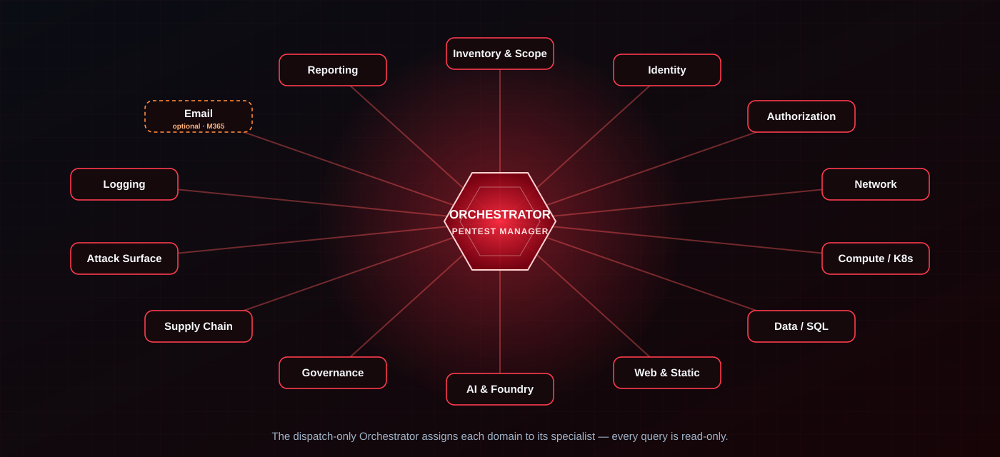

# The Agent Team



A single user-invocable **Orchestrator** (Pentest Manager) coordinates the engagement and
hands tasks to fifteen domain specialists via the runtime's agent-dispatch (Task) tool — plus two
**gated** active-testing lanes (the EVA agent and the Azure Container & Kubernetes agent's
in-cluster lane) that are off by default. In the canonical
[graph-engineered flow](graph-engineering.md), the read-only roster is the `plan_specialists`
fan-out layer: each in-scope domain is sent to `run_specialist` in parallel, then reduced back
into the shared finding state. The orchestrator is **dispatch-only** — it has no shell access
and never runs `az` itself; it assigns work to specialists and aggregates the findings they
return.

| Agent | Domain | Key Focus |
|---|---|---|
| **Orchestrator** | Coordination | Engagement lifecycle, task dispatch, finding aggregation |
| **Inventory & Scope** | Preflight | Resource enumeration, permission validation, scope enforcement |
| **Identity Posture** | Entra ID | MFA gaps, Conditional Access, app registrations, guest users, credential hygiene |
| **Authorization & Attack Path** | RBAC / Privilege | Over-permissioned roles, custom role abuse, managed identity chains, priv-esc paths |
| **Network Exposure** | Networking | Public IPs, NSG rules, firewall gaps, VNet peering, DNS exposure, private endpoints |
| **Compute Platform** | Compute (VM / App Service / Functions) | VM disk encryption & patching, public RunCommand exposure, Function Apps, App Service auth / FTP-debug / plaintext-secret hardening |
| **Azure Container & Kubernetes** | AKS / Kubernetes / ACR / Containers | AKS & in-cluster Kubernetes RBAC, Pod Security Admission, workload identity, ACR content-trust & image scanning, Container Apps/Instances — read-only posture plus an optional, hard-gated lane that scans *inside* running containers |
| **Data Protection** | Storage / Data / SQL | Storage exposure, Key Vault policies, SQL & database firewall rules, encryption |
| **Web & Static Sites** | Web edge / delivery | CDN/Front Door, WAF, TLS, Static Web Apps & storage static sites, API Management |
| **AI & Foundry** | AI services | Azure AI Foundry, Azure OpenAI, Cognitive Services, ML workspace exposure |
| **Attack Surface (EASM)** | External exposure | Outside-in footprint, dangling DNS / subdomain takeover, orphaned IPs, unknown assets |
| **Logging Coverage** | Monitoring | Diagnostic settings, Sentinel connectors, alert rules, Activity Log gaps |
| **Governance & Posture** | Governance / Posture | Azure Policy guardrails & exemptions, Defender for Cloud secure score, MG hierarchy, resource locks |
| **DevOps & Supply Chain** | CI/CD / Supply chain | Workload identity federation (OIDC), pipeline service principals, ACR admin/tasks, Automation Accounts, Logic Apps |
| **Email Security** *(optional)* | Microsoft 365 | SPF/DKIM/DMARC, Exchange Online Protection, Defender for Office 365, mail-flow rules |
| **External Vulnerability (EVA)** *(gated)* | Active external testing | OWASP Top 10 validation of Azure-discovered URLs/IPs; optional offline static analysis — scope-locked, off by default |
| **Reporting** | Output | Finding normalization, severity reconciliation, executive + technical reports |

:::{note}
The **Email Security** agent covers Microsoft 365 / Exchange Online and is dispatched only
when M365 is in engagement scope. Entra ID, RBAC, and SQL/databases are covered by the
Identity, Authorization, and Data agents respectively; AKS / Kubernetes / containers / ACR
are covered by the dedicated **Azure Container & Kubernetes** agent (the Compute agent now
focuses on VMs, App Service, and Functions).
:::

:::{important}
The **Azure Container & Kubernetes agent** runs read-only by default. Its **cluster-active
lane** — the only path that reaches *inside* a running cluster/container or pulls and scans
images — is **off by default** and unlocks only when the engagement `mode` is
`cluster-active-testing` with an enabled, signed `cluster_testing` authorization. It is
scope-locked to an Azure-derived cluster/registry allowlist, enforced fail-closed by a third
cluster guardrail, and never mutates a workload. See
[Safety & Authorization](safety.md#active-external-testing-eva).
:::

:::{important}
The **External Vulnerability Agent (EVA)** is the only agent that sends real traffic to live
endpoints. It is **off by default** and dispatched only when the engagement `mode` is
`external-active-testing` with an enabled, signed `external_testing` authorization. It tests
**only** hosts on the Azure-derived target allowlist, enforced fail-closed by a second egress
guardrail. See [Safety & Authorization](safety.md#active-external-testing-eva).
:::

## How it works

```{mermaid}
graph TD
    User[Security Engineer] -->|/recon or /assess| Orchestrator
    Orchestrator -->|1. Preflight| Preflight[Inventory & Scope Agent]
    Preflight -->|Resource inventory| Orchestrator
    Orchestrator -->|2. Dispatch| Agents

    subgraph Agents[Domain Agents]
        ID[Identity Posture]
        NET[Network Exposure]
        COMP[Compute · VM/App Service]
        CNTR[Containers & Kubernetes]
        DATA[Data Protection]
        WEB[Web & Static Sites]
        AI[AI & Foundry]
        EASM[Attack Surface / EASM]
        GOV[Governance & Posture]
        SUP[DevOps & Supply Chain]
        LOG[Logging Coverage]
        MAIL[Email Security · optional]
        AUTH[Authorization & Attack Path]
    end

    Agents -->|Structured findings| Orchestrator
    Orchestrator -->|3. Correlate| APA[Attack Path Analysis]
    APA -->|Attack chains| Orchestrator
    Orchestrator -->|4. Report| Reporter[Reporting Agent]
    Reporter -->|Final report| User
```

## How the team is packaged

The team uses three native AI-runtime layers that map cleanly onto **who acts**, **what
they know**, and **what they're allowed to do**. The canonical layout below is Copilot's
(`.github/`); the [generator](runtimes.md) mirrors these same three layers into the Claude,
Codex, and Cursor runtimes from this single source.

### 1. Custom agents — the dispatchable team (`.github/agents/`)

The Orchestrator is the only **user-invocable** agent; the fifteen specialists set
`disable-model-invocation: true` so they run only when the Orchestrator dispatches them
through the `agent` (Task) tool. The Orchestrator is **dispatch-only** — it has no
`execute`/shell capability, so it never runs `az` itself.

### 2. Skills — auto-loaded domain knowledge (`.github/skills/`)

Each agent's deep methodology is a Copilot **skill**, loaded automatically by its
`description`. See [Skills & Methodology](methodology.md) for the full skill map.

### 3. Extension / hooks — read-only enforcement (`.github/extensions/redteam-guardrails`)

A session-wide `preToolUse` hook enforces read-only as an **allowlist (deny-by-default)**.
Because it is session-wide, it covers **every** agent. See
[Safety & Authorization](safety.md) for details.

Each skill stays thin and delegates to the detailed methodology in
`agents/<name>/system-prompt.md` and the atomic tests in `checks/<domain>/checks.yaml`,
keeping a single source of truth.

:::{tip}
**Running on Claude Code, OpenAI Codex, or Cursor?** All three layers are generated for you
from these `.github/` sources — agents, skills, and the read-only guard hook — so the team
behaves identically on every runtime. See [AI Model Runtimes](runtimes.md).
:::
