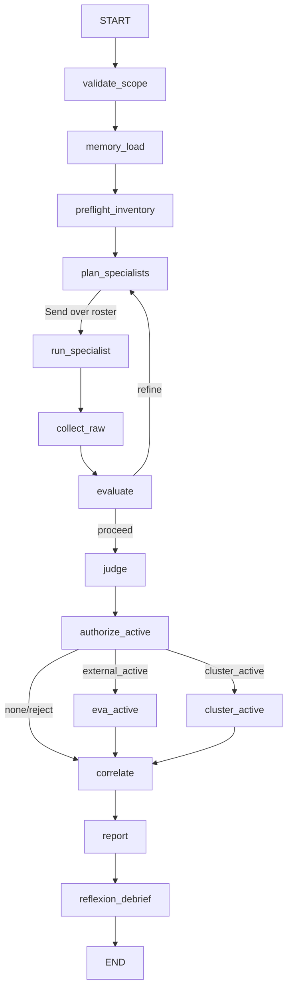

# LangGraph deployment target

`integrations/langgraph/` is a first-class, isolated LangGraph deployment target for the Azure red-team agent framework. It compiles the canonical declarative graph at `graph/redteam.graph.json` into a Python `StateGraph` without adding dependencies to the dependency-free core (`tools/`, `guardrails/`, `graph/`, `schemas/`). All Python dependencies and runtime files for this target live under this directory.

## Mapping the canonical graph to LangGraph

- `state.channels` becomes a generated `TypedDict` state schema.
  - `last` channels use normal last-write-wins assignment.
  - `append` channels use `Annotated[list, operator.add]` for fan-in concatenation.
  - `merge_findings` channels use a custom reducer that dedupes by `dedupe_key` and unions `affected_resources` while applying last-write-wins for other fields.
- `nodes[]` are compiled one-for-one into LangGraph nodes.
- `fanout` (`plan_specialists`) maps the in-scope roster to `Send("run_specialist", ...)` calls; `run_specialist` is the specialist-dispatch integration point.
- `conditional_edges[]` become LangGraph conditional edges. `route_after_evaluate` implements the bounded evaluator-optimizer reflection loop using `params.max_revisions` and `params.quality_threshold`; `route_active` selects the gated active lane or skips to correlation.
- `interrupt` (`authorize_active`) maps to LangGraph `interrupt()` for human authorization before active testing lanes.
- `memory_read`, `judge.memory_write`, and `memory_write` use a methodology-only memory layer intended to persist cross-run procedural learning under repo-root `memory/methodology/` at runtime.

## Read-only guard bridge

Python does **not** reimplement guardrail logic. `redteam_langgraph.guard.decide()` shells out to the repo's canonical Node guard:

```powershell
echo '{"command":"az vm list","cwd":".","toolName":"bash"}' | node guardrails/guard.mjs
```

Any subprocess failure, missing `node`, non-JSON output, invalid shape, or empty command fails closed as `deny`. `guarded_run()` blocks every non-`allow` decision before executing anything. Specialist node bodies are intentionally stubbed as integration points; any future Azure command execution must go through this bridge so LangGraph and the CLI runtimes share one source of truth.

## Self-improving loops and memory firewall

The evaluator/optimizer loop (`evaluate -> plan_specialists`) is bounded by the graph params. The judge and `reflexion_debrief` persist learned false-positive suppression hints, investigation workflows, and methodology notes into the **methodology** namespace only. The memory layer rejects `guardrails`, `allowlist`, `egress`, `readonly`, and `guard` namespaces, so self-improvement cannot rewrite enforcement policy.

## Compiled topology



## Install and run

```powershell
py -3.12 -m venv integrations\langgraph\.venv
integrations\langgraph\.venv\Scripts\python.exe -m pip install -r integrations\langgraph\requirements.txt
integrations\langgraph\.venv\Scripts\python.exe -m redteam_langgraph.run --graph graph\redteam.graph.json --dry-run
integrations\langgraph\.venv\Scripts\python.exe -m pytest integrations\langgraph\tests -q
```

Dry-run mode builds the graph and prints the compiled node/edge topology without Azure credentials or network access.

## Current stubs

The deployment target wires the real graph topology, reducers, guard bridge, checkpointer, interrupt, and methodology memory firewall. Specialist execution is stubbed because actual dispatch to Copilot/Claude/Codex/Cursor agent cards is runtime-specific; `builder.py` marks the exact callable where the agent-card adapter should be connected.
